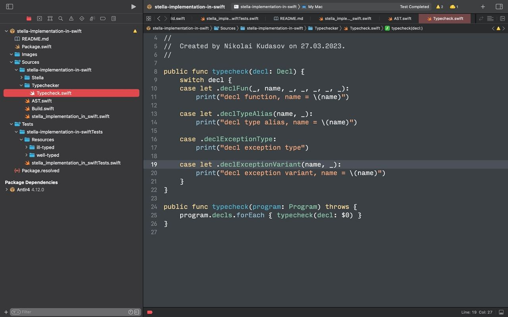
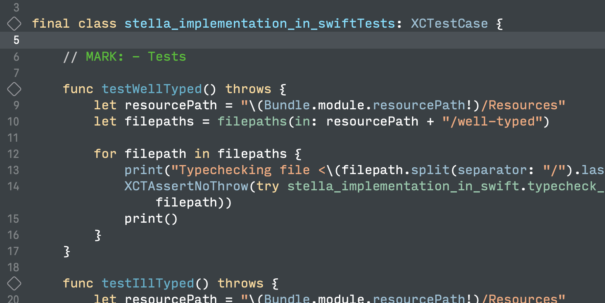
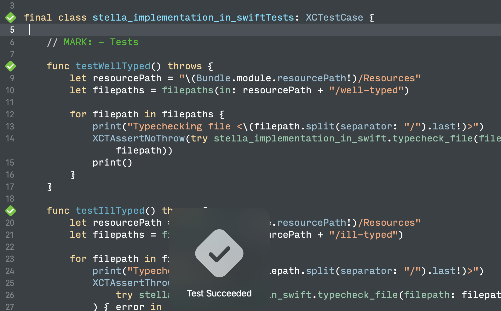

# Stella in Swift
Template for an implementation of Stella in Swift.

## How to run?

Open project in Xcode -> Tests -> stella-implementation-in-swiftTests -> stella_implementation_in_swiftTests.swift:

Tap on the rotated square in line 4 to run all tests. In case of success you will see green color and "Test Succeeded":

